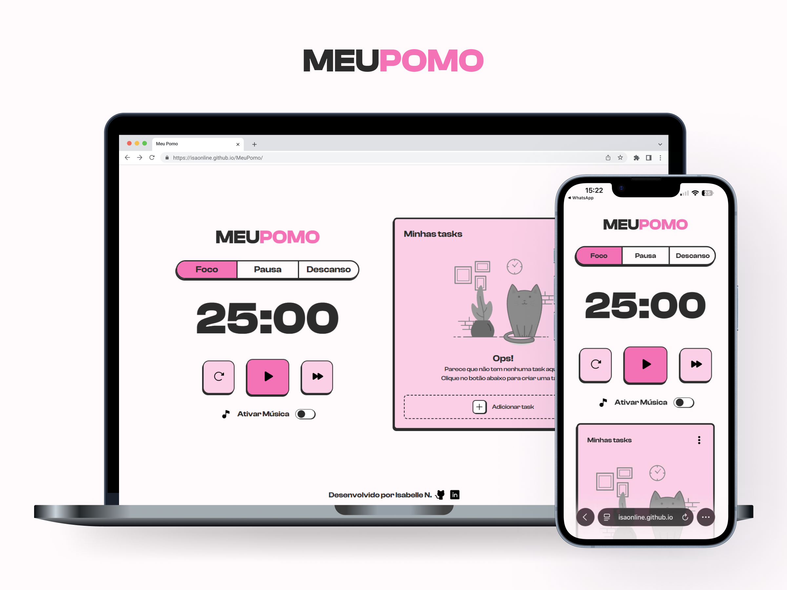

# MeuPomo

Aplicação web de produtividade construída com JavaScript vanilla, HTML e CSS. Combina a técnica Pomodoro com um sistema completo de gerenciamento de tarefas (CRUD) com persistência local.

   

## Tabela de Conteúdo

- [Visão Geral](#visão-geral)
  - [Prévia](#prévia)
  - [Link](#link)
  - [Funcionalidades](#funcionalidades)
- [Desenvolvimento](#desenvolvimento)
  - [Tecnologias](#tecnologias)
  - [O que aprendi](#o-que-aprendi)
  - [Desafios](#desafios)
- [Criado por](#criado-por)

## Visão Geral

### Prévia

### Link

- Acesse o MeuPomo agora: [Clique aqui!](https://isaonline.github.io/MeuPomo/)

### Funcionalidades
- Timers para foco, pausa e descanso com duração adequada para cada modo.
- Botões para resetar, iniciar, parar o tempo e passar o modo.
- Função integrada para tocar música relaxante que se mantém em todos os modos.
- Controle total de tarefas, com um sistema CRUD que permite:
    - Criar novas tarefas;
    - Consultar todas as tarefas criadas;
    - Editar tarefas individualmente;
    - Excluir tarefas individualmente ou múltiplas tarefas de uma vez.
- Responsividade para telas menores e mobile.

---

## Desenvolvimento

### Tecnologias

  
  
  
  
  
  
  
  
  
  

### O que aprendi

Sendo um projeto de maior complexidade e com funções que aprendi em cursos guiados, foi um desafio difícil, mas muito enriquecedor. Durante todas as fases pude **desenvolver meu olhar técnico**, aplicando as funcionalidades com cautela para manter a estabilidade da lógica e do visual do projeto.
Aprendi na prática como funciona **manipulação do DOM com JavaScript vanilla**, **persistência de dados com localStorage**, **event delegation**, **geração de IDs únicos** com **crypto.randomUUID()**, **especificidade CSS** e como **depurar lógica de estado em interfaces com múltiplas condições simultâneas**.

### Desafios

O maior desafio foi gerenciar um formulário com dupla responsabilidade (criar e editar tasks) sem duplicar lógica. A solução foi usar uma variável **idEditavelAtual** como sinalizador de estado: quando nula, o form cria; quando preenchida, edita.

Durante o desenvolvimento, pesquisei e apliquei soluções que não conhecia previamente, como event delegation para gerenciar cliques em elementos dinâmicos sem criar múltiplos listeners, e crypto.randomUUID() para geração de IDs únicos e confiáveis para cada task. Esses aprendizados vieram da necessidade real do projeto, não de um roteiro pré-definido.

Outro ponto desafiador foi manter a UI sincronizada com o localStorage sem recarregar a página, o que exigiu atenção à ordem de execução das funções de render e verificação.

Em projetos futuros, separaria melhor as responsabilidades das funções e consideraria usar um framework para gerenciar estado de forma mais previsível.

### Criado por

- Código, projeto e lógica - [Isabelle Nascimento](https://www.linkedin.com/in/isanasc/)
- UI/UX Design - [Felipe Souza](https://www.linkedin.com/in/felipesouza12/)